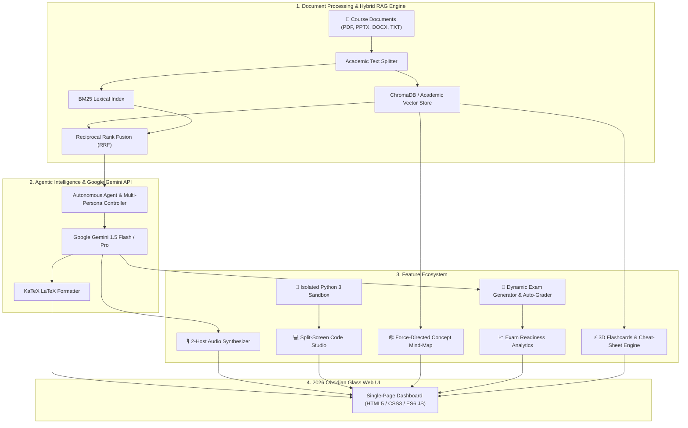

<div align="center">

# 🎓 SyllabusAI — Autonomous Academic Agent & Grounded Exam Prep

[](https://www.python.org/)
[](https://fastapi.tiangolo.com/)
[](https://ai.google.dev/)
[](https://katex.org/)
[](LICENSE)

**An ultra-modern, full-stack autonomous AI academic agent, grounded RAG retrieval engine, NotebookLM-style 2-host audio podcast synthesizer, split-screen live code execution studio, force-directed concept mind-map, and exam readiness analytics platform.**

[Features](#-key-features) • [Architecture](#-system-architecture) • [Modules](#-application-modules) • [API Reference](#-api-endpoints) • [Quickstart](#-quickstart--installation)

</div>

---

## 🌟 Key Features

- **🤖 Dual-Mode Autonomous AI Agent**:
  - `🤖 AI Agent Mode`: Delivers natural, ChatGPT-quality conversational answers with code blocks, math derivations, and grounded syllabus citations.
  - `🎓 Strict Exam Mode`: Zero-hallucination guardrail locking answers exclusively to verified textbook and syllabus text.
- **🎭 4 Academic Personas**: Switch dynamically between *ChatGPT All-Rounder*, *Academic Professor*, *Socratic Tutor*, and *Code & Algorithm Mentor*.
- **🎙️ 2-Host Audio Deep Dive (NotebookLM-Style)**:
  - Generates realistic, natural multi-turn study discussions between two AI hosts (**Alex** 🎙️ and **Taylor** 🎧).
  - Real-time Web Speech API voice synthesis, animated multi-frequency spectrum equalizer canvas, glowing speaker auras, and auto-scrolling live transcript.
- **💻 Split-Screen Canvas Studio**:
  - **Live Python 3 Sandbox Execution** (`/api/code/run`) with execution timer and status badges.
  - Preloaded algorithm templates (*Banker's Algorithm, LRU Page Replacement, Singly Linked List, EMAT Calculation*).
  - **Source Citation Diff Inspector**: Side-by-side inspection of textbook excerpts with verified cosine relevance scores.
- **🕸️ Interactive Concept Mind-Map & Knowledge Graph**:
  - Force-directed physics canvas mapping topics, core concepts, formulas, and chapters.
  - Interactive dragging, zooming, search filtering, and 1-click **"💬 Ask AI"** or **"📝 Practice"** actions on any concept node.
- **📈 Exam Readiness Analytics & Mastery Dashboard**:
  - Real-time **Exam Readiness Gauge (0-100%)**, study streak tracker, accuracy rate, and topic mastery bars.
  - **Automated Diagnostic Recommendations**: Identifies weak areas (< 75% accuracy) and offers 1-click targeted practice exams.
- **📝 Exam & Assessment Arena**:
  - Dynamic MCQ and Descriptive question generator with configurable difficulty.
  - Interactive quiz taking, instant auto-grading scorecard, and **Printable / Downloadable Markdown Exam Worksheets**.
- **⚡ Revision & 3D Flashcards**:
  - Active recall 3D flip cards with self-assessment ratings and one-click consolidated chapter cheat-sheet compiler with Markdown export.
- **🎨 2026 Obsidian Glassmorphism Design System**:
  - 5 Curated Themes (*Deep Nebula, Ocean Sapphire, Midnight Emerald, Sunset Horizon, Daylight Academic*).
  - Apple/Linear-grade fluid spring physics transitions (`cubic-bezier(0.16, 1, 0.3, 1)`).

---

## 📐 System Architecture



---

## 📁 Project Directory Structure

```
Syllabus-RAG-AI-Agent/
├── server.py                        # FastAPI web server, REST API, & static router
├── requirements.txt                 # Python dependencies
├── .env.example                     # API key template
├── README.md                        # Documentation
├── web/                             # Frontend Web Application Suite
│   ├── index.html                   # Semantic HTML5 Single-Page App
│   ├── css/
│   │   └── style.css                # 2026 Obsidian Glass & Spring Motion Design System
│   └── js/
│       └── app.js                   # State management, Audio Synthesizer, Graph Engine, KaTeX
├── core/                            # Backend Core Engine & Intelligence Modules
│   ├── __init__.py
│   ├── agent_engine.py              # Autonomous multi-persona agent & grounded RAG
│   ├── audio_podcast.py             # 2-host conversational dialogue generator
│   ├── knowledge_graph.py           # Force-directed concept mind-map generator
│   ├── analytics.py                 # Exam readiness analytics & weak area diagnostics
│   ├── quiz_generator.py            # Dynamic MCQ & descriptive exam creator + auto-grader
│   ├── syllabus_analyzer.py         # 3D flashcards & high-yield cheat-sheet compiler
│   ├── document_loader.py           # Multi-format parser (PDF, PPTX, DOCX, TXT)
│   ├── text_splitter.py             # Academic recursive text chunking
│   ├── vector_store.py              # Dense embeddings + cosine similarity search
│   └── config.py                    # Paths, default models, persona prompts
├── sample_data/                     # Preloaded academic course materials
│   └── operating_systems_sample.txt # CS301 Operating Systems (Virtual Memory, Deadlocks)
└── data/                            # Persistent data storage
    ├── uploaded_docs/               # Uploaded course materials
    └── vector_db/                   # Persistent vector database index
```

---

## 🔌 API Endpoints

| Method | Route | Description |
| :--- | :--- | :--- |
| `GET` | `/api/status` | Health check, document index stats, and active model status. |
| `POST` | `/api/query` | SSE Streaming endpoint for AI Agent Chat queries with citation metadata. |
| `POST` | `/api/podcast/generate` | Generates a 2-host conversational study podcast dialogue. |
| `GET` | `/api/graph/data` | Returns node and edge topology for the interactive concept mind-map. |
| `GET` | `/api/analytics/overview` | Returns exam readiness percentage, topic mastery scores, and weak area alerts. |
| `POST` | `/api/code/run` | Executes Python 3 / JS code in an isolated sandbox subprocess. |
| `POST` | `/api/quiz/generate` | Generates dynamic MCQ or descriptive examination papers. |
| `POST` | `/api/quiz/submit` | Auto-grades student answers, generating scores and textbook page rationales. |
| `POST` | `/api/quiz/export` | Generates a formatted, printable Markdown examination worksheet. |
| `POST` | `/api/flashcards/generate` | Generates active recall flashcards with 3D flip capabilities. |
| `POST` | `/api/cheatsheet/generate` | Compiles a high-yield summary cheat-sheet for the course. |
| `POST` | `/api/upload` | Uploads and indexes multi-format course materials (PDF, PPTX, DOCX, TXT). |
| `POST` | `/api/config/key` | Updates Gemini API key and active generative model. |

---

## 🚀 Quickstart & Installation

### 1. Clone the Repository
```bash
git clone https://github.com/R0HITHRAO/Syllabus-RAG-AI-Agent.git
cd Syllabus-RAG-AI-Agent
```

### 2. Set Up Virtual Environment & Install Dependencies
```bash
# Create virtual environment
python -m venv .venv

# Activate on Windows (PowerShell)
.\.venv\Scripts\Activate.ps1

# Activate on macOS/Linux
source .venv/bin/activate

# Install dependencies
pip install -r requirements.txt
```

### 3. Configure API Key
Create a `.env` file in the root directory:
```env
GEMINI_API_KEY=your_google_gemini_api_key_here
```
*(You can also configure your API key dynamically in the web UI Settings modal).*

### 4. Launch the Server
```bash
python server.py
```

### 5. Access the Web Dashboard
Open your browser and navigate to:
👉 **`http://localhost:8000`**

---

## 📄 License
This project is open-source and available under the [MIT License](LICENSE).
